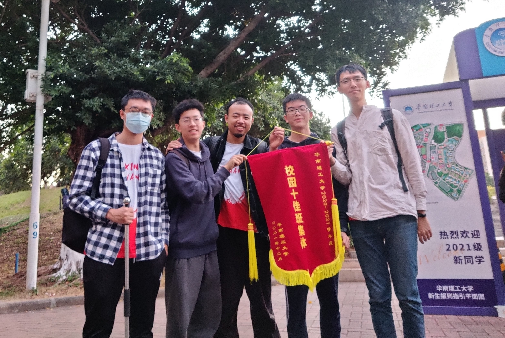

### Hello Guys! 👋😀
# 每个优秀的人都有一段沉默的时光，那段时光，是付出了很多努力，却得不到结果的日子。我们把它叫做扎根

#### 我是谁 🔭
- 华南理工大学在读大四臭👶👶
- 不会焊电路板的电信学生😄
- 溺死在DL大海的🏄‍家
####  View my stats on Github 

#### 我在学什么 🌱
- OCR
- GAN
- Domain Generalization
- Normalizations

#### 未来打算做什么
- 努力做研究，探索广袤的深度学习

#### 联系方式 📫
- mountchicken@outlook.com
- Wechat: jq927922033

